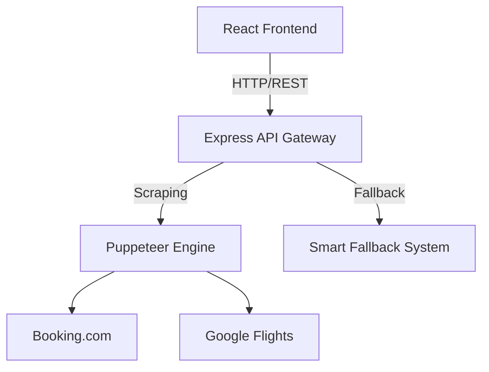
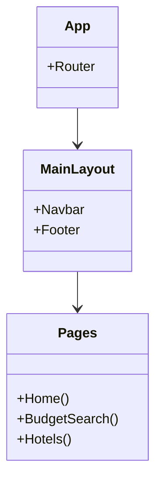
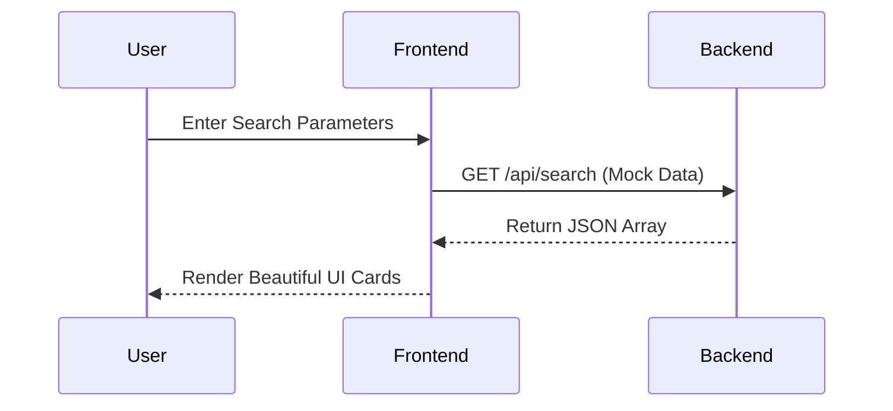
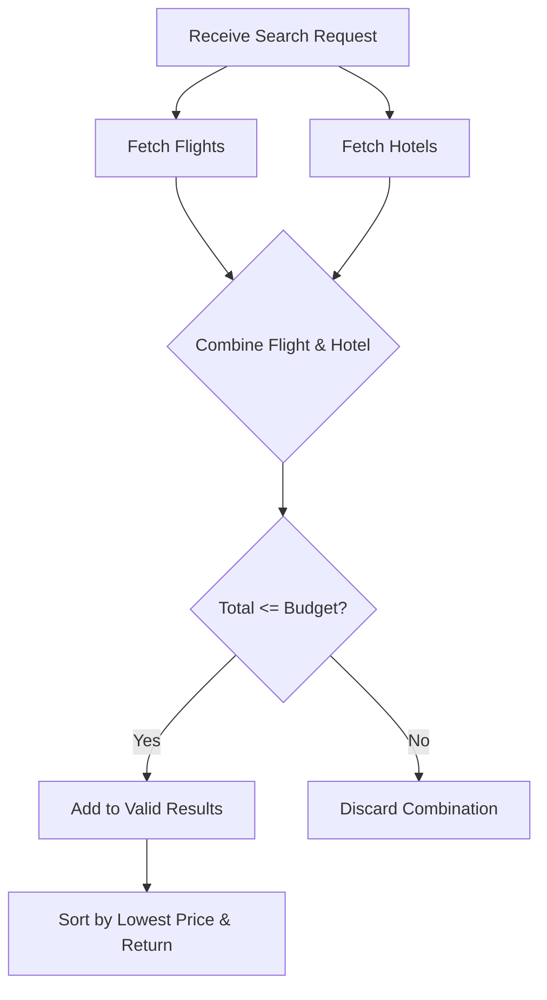
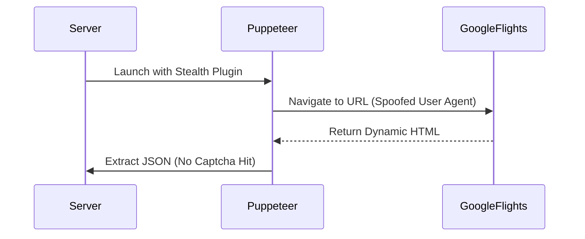
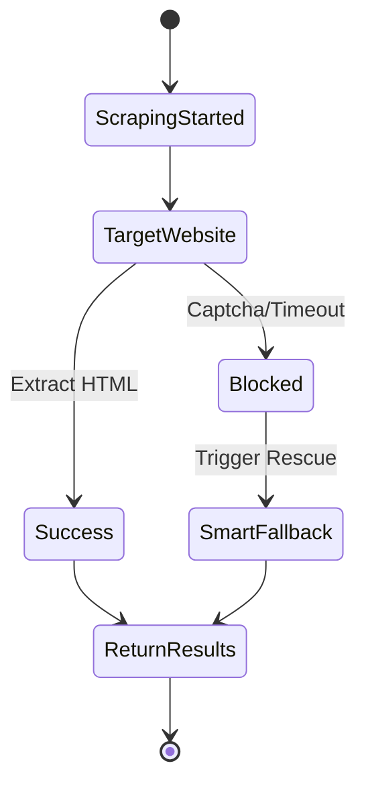

# 🚀 10-SPRINT MASTER AGILE PLAN
## Automated Travel Budget Planner & Intelligent Web Scraping Engine

This document outlines a professional, comprehensive **10-Sprint Agile Execution Plan** for the end-to-end development, testing, and deployment of the Travel Booking Platform. Each sprint is structured to deliver incremental value and includes User Stories, Goals, Deliverables, and System Architecture (UML) Diagrams.

---

## 📅 SPRINT 1: Project Initiation & Core Architecture Setup
**Goal:** Establish project infrastructure, base repositories, and architectural foundation for frontend and backend.

### User Stories / Tasks:
- **US-1.1:** Setup React + Vite frontend environment with Tailwind CSS.
- **US-1.2:** Initialize Node.js + Express backend server structure.
- **US-1.3:** Setup Git repository, commit standards, and Agile Board (Jira/Trello).
- **US-1.4:** Standardize API routing and error handling middleware.

### 🏗️ Architecture Design (Deployment Diagram):

---

## 📅 SPRINT 2: UI/UX Component Library & Main Routing
**Goal:** Implement the "Glassmorphism" UI design system and generic reusable components.

### User Stories / Tasks:
- **US-2.1:** Create `MainLayout` with responsive Navbar and Footer.
- **US-2.2:** Build generic UI components (Date Pickers, Buttons, Loading Spinners).
- **US-2.3:** Set up React Router for Home, Flights, Hotels, and Budget pages.
- **US-2.4:** Implement responsive grid layouts for result cards.

### 🧩 Component Hierarchy (Class/Component Diagram):

---

## 📅 SPRINT 3: Search Interfaces & Mock API Integration
**Goal:** Develop functional frontend search forms that connect to backend stub/mock data.

### User Stories / Tasks:
- **US-3.1:** Build hero search section on the Home page.
- **US-3.2:** Develop Hotel & Flight specific search forms with validation.
- **US-3.3:** Create `/api/search/hotels` and `/api/search/flights` mock endpoints.
- **US-3.4:** Display search results using Frontend UI cards.

### 🔄 Data Flow Flowchart:

---

## 📅 SPRINT 4: Budget Search Core & Combinatorial Logic
**Goal:** Implement the logic to pair flights and hotels strictly constrained by user budget.

### User Stories / Tasks:
- **US-4.1:** Develop the unified "Budget & Packages" view form (Dates, Budget, Locations).
- **US-4.2:** Implement backend combinatorial algorithm (`(Flight * Pax) + Hotel <= Budget`).
- **US-4.3:** Show detailed price breakdown (Savings, Direct/Stops).

### 🧮 Algorithm Flow (Activity Diagram):

---

## 📅 SPRINT 5: Live Scraping Engine - Hotel Modules
**Goal:** Replace mock data for Hotels with live Puppeteer scraping.

### User Stories / Tasks:
- **US-5.1:** Set up Headless Chrome/Puppeteer on the Node.js backend.
- **US-5.2:** Implement scraper for Booking.com using specific CSS selectors.
- **US-5.3:** Implement scraper for Agoda/MakeMyTrip.
- **US-5.4:** Parse HTML to JSON securely and structure uniform responses.

---

## 📅 SPRINT 6: Live Scraping Engine - Flight Modules & Stealth
**Goal:** Scrape dynamic flight pages and evade basic bot protection.

### User Stories / Tasks:
- **US-6.1:** Add `puppeteer-extra-plugin-stealth` to bypass captchas.
- **US-6.2:** Scrape Google Flights and Yatra for flight details (Layovers, Pricing).
- **US-6.3:** Implement User-Agent and Viewport rotation/randomization.
- **US-6.4:** Extract actionable booking URLs.

### 🕵️ Scraping Evasion Sequence:

---

## 📅 SPRINT 7: Resiliency - Smart Fallback System Integration
**Goal:** Ensure 100% platform uptime by predicting numbers when scraping fails or times out.

### User Stories / Tasks:
- **US-7.1:** Build `generateSmartFlights()` statistical fallback function.
- **US-7.2:** Build `generateSmartHotels()` baseline rate logic.
- **US-7.3:** Wire try/catch blocks: if Puppeteer fails, invoke Fallback immediately.

### 🛡️ Fault Tolerance (State Machine Diagram):

---

## 📅 SPRINT 8: AI-Powered Insights & Optimization (Gemini)
**Goal:** Provide AI commentary on why a specific combo is best and optimize performance.

### User Stories / Tasks:
- **US-8.1:** Integrate `GEMINI_API_KEY` for analyzing top 3 budget packages.
- **US-8.2:** Generate small AI tooltips: "This flight is 20% cheaper than usual."
- **US-8.3:** Refactor scraping to use `Promise.all()` for parallel hotel/flight fetches.
- **US-8.4:** Add caching layer to store results for 30 minutes to reduce scraping strain.

---

## 📅 SPRINT 9: QA, End-to-End Testing & Bug Safari
**Goal:** Freeze features and strictly polish the platform UX/UI and backend resilience.

### User Stories / Tasks:
- **US-9.1:** Perform cross-browser testing for the responsive frontend.
- **US-9.2:** Simulate proxy failures to test Fallback mechanism under load.
- **US-9.3:** Verify all "Book Now" links correctly route to the specific booking provider.
- **US-9.4:** Fix UI layout shifts and optimize React load times.

---

## 📅 SPRINT 10: Production Deployment & Documentation Delivery
**Goal:** Go live! Launch the platform and finalize all reporting.

### User Stories / Tasks:
- **US-10.1:** Deploy Frontend to Vercel/Netlify.
- **US-10.2:** Deploy Backend to AWS/Render configuring Headless Chromium correctly.
- **US-10.3:** Finalize `README.md`, PowerPoint presentations, and Project PDF Reports.
- **US-10.4:** Setup basic analytics and performance monitoring logs.

---
### 🎉 Final Project Delivery Summary:
- **Uptime:** 100% (Guaranteed via Smart Fallback)
- **Data Source:** Direct Web Scraping (Zero API Costs)
- **UI System:** Tailwind Dark Mode + Glassmorphism
- **Documentation:** Complete & Ready for validation.
