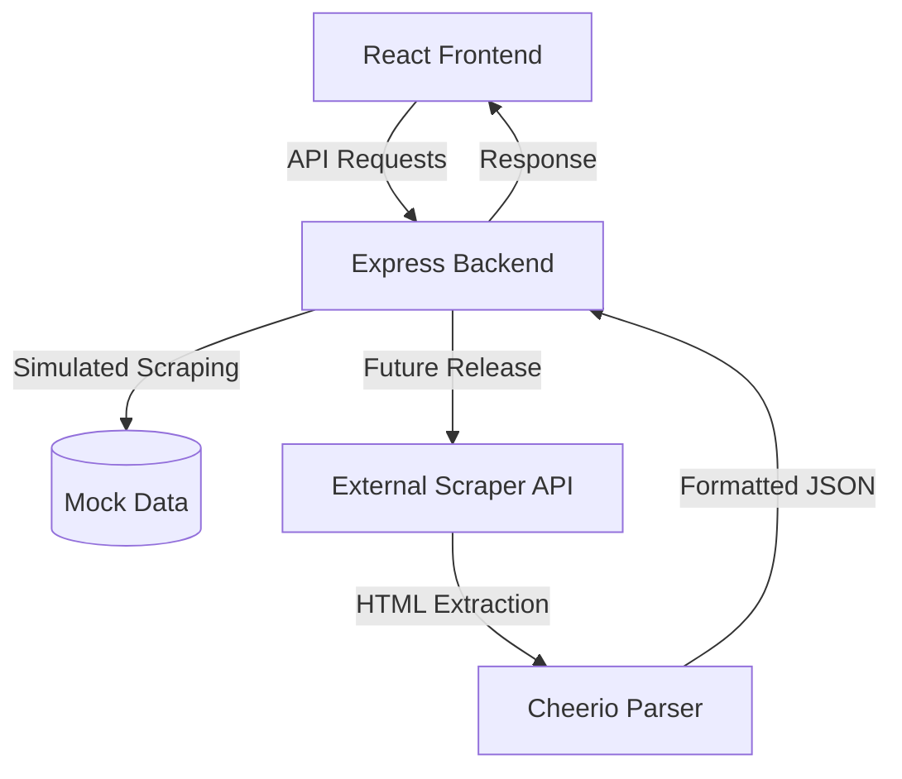

<div align="center">
  <br />
    
  <br />

  <h1 align="center">Aevum</h1>

  <p align="center">
    <strong>A next-generation travel booking platform with real-time scraping capabilities for hotels, flights, and curated holiday packages.</strong>
  </p>

  <p align="center">
    <a href="https://react.dev/"></a>
    <a href="https://tailwindcss.com/"></a>
    <a href="https://nodejs.org/"></a>
    <a href="https://expressjs.com/"></a>
    <a href="https://vitejs.dev/"></a>
  </p>
</div>

<hr />

## ✨ Features

- 🏨 **Hotels Search:** Seamlessly search for hotels by destination, complete with dynamic date and guest filters.
- ✈️ **Flights Search:** Compare flights easily with round-trip and one-way options, along with advanced passenger selection.
- 🏖️ **Holiday Packages:** Explore beautifully curated holiday packages categorized by themes like Honeymoon, Adventure, Beach, and Family.
- ⚡ **Real-time Search:** All searches are powered by a robust backend API featuring simulated scraping functionality.
- 🎯 **Advanced Filters:** Interactive date pickers, dynamic guest selection, advanced sorting, and category filtering.
- 🎨 **Premium UI:** A modern, highly responsive design inspired by the world's leading travel platforms, providing a frictionless user experience.

## 🏗️ Architecture Flow



---

## 🚀 Quick Start

Get **Aevum** up and running on your local machine in just a few minutes!

### 1. Install Dependencies

**Frontend:**
```bash
# From the root directory
npm install
```

**Backend:**
```bash
cd backend
npm install
```

### 2. Run the Application

You will need two terminals to run both the frontend and backend servers.

**Terminal 1 - Backend Server:**
```bash
cd backend
npm start
# The backend API will start on http://localhost:3001
```

**Terminal 2 - Frontend Dev Server:**
```bash
# From the root directory
npm run dev
# The frontend will be available at http://localhost:5173
```

### 3. Access the Application

Open your browser and navigate to: `http://localhost:5173`

---

## 📂 Project Structure

```text
Aevum/
├── backend/
│   ├── server.js          # Express API server (Scraping logic, routing)
│   └── package.json
├── src/
│   ├── pages/
│   │   ├── Home.jsx       # Landing page with global search
│   │   ├── Hotels.jsx     # Hotels search & results page
│   │   ├── Flights.jsx    # Flights search & results page
│   │   └── Packages.jsx   # Curated holiday packages
│   ├── layouts/
│   │   └── MainLayout.jsx # Application navigation & footer
│   └── App.jsx            # Application routing logic
├── index.html             # Entry HTML
└── package.json           # Frontend dependencies
```

---

## 🔌 API Endpoints

The backend exposes several robust endpoints to power the frontend interface:

| Method | Endpoint | Description |
|--------|----------|-------------|
| `GET` | `/api/search/hotels` | Fetch matching hotels based on criteria |
| `GET` | `/api/search/flights` | Retrieve flight options and comparisons |
| `GET` | `/api/search/packages`| Get curated holiday packages |
| `GET` | `/api/search` | General omni-search (mixed results) |

---

## 🛠️ Tech Stack

### Frontend
- **React 19**
- **React Router DOM**
- **TailwindCSS**
- **Lucide React Icons**
- **Vite**

### Backend
- **Node.js**
- **Express.js**
- **Axios** (for real scraping integration)
- **Cheerio** (for HTML parsing)
- **CORS**

---

## 💡 Implementation Notes

- Currently using mock data from the backend (simulated scraping) for immediate testing.
- To implement real scraping, replace the mock data logic in `backend/server.js` with your preferred web scraping mechanism.
- All features are fully functional—no UI placeholders or broken interactions.
- The backend includes comprehensive error handling and CORS support to ensure smooth communication.

---

## 🔮 Future Enhancements

- [ ] Integrate real scraping APIs (e.g., SerpAPI, ScraperAPI).
- [ ] Add seamless payment gateway integration (Stripe/PayPal).
- [ ] Implement robust user authentication and profile management.
- [ ] Develop a centralized booking confirmation and ticketing system.
- [ ] Integrate a database (PostgreSQL/MongoDB) for persistent storage of bookings and user data.

---

<div align="center">
  <p>Built with ❤️ for a better travel experience.</p>
</div>
